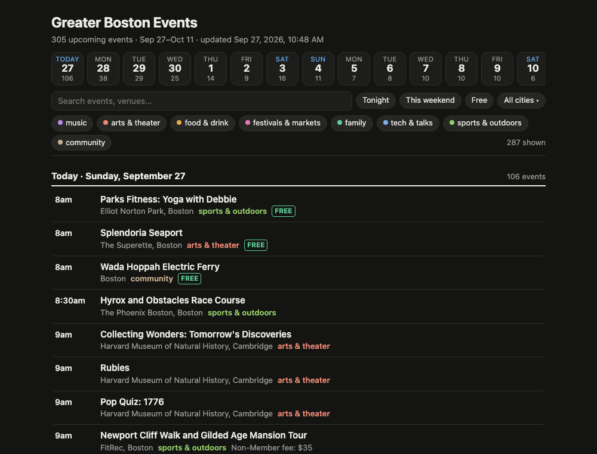
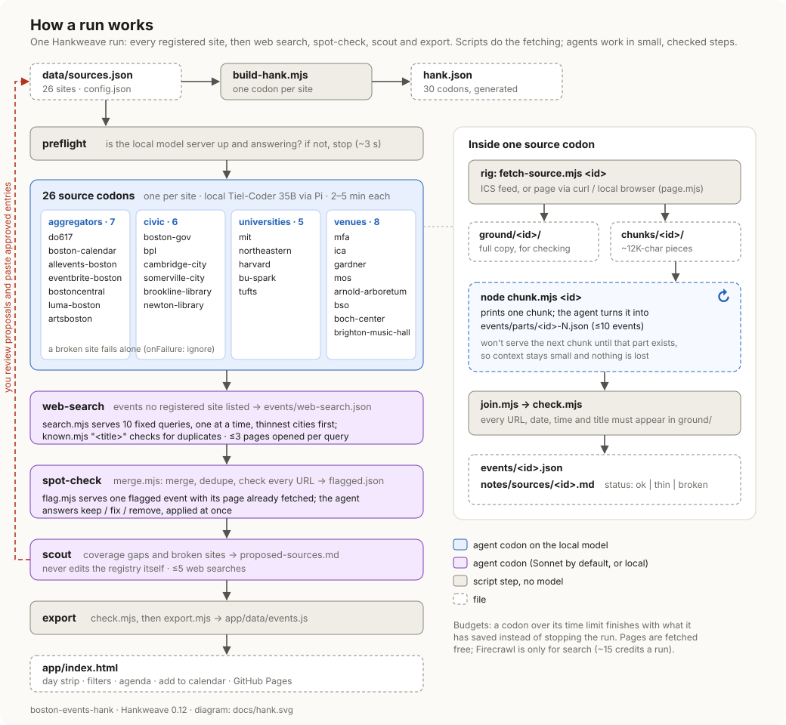

# Greater Boston Events

A [Hankweave](https://hankweave.southbridge.ai) hank that collects the next two weeks of events in Boston and nearby cities, and a small static app to browse them, register, and add them to your calendar.

**Live demo:** https://ergest.github.io/boston-events-hank/ (a snapshot from one run; it is not updated automatically)



A hank is a sequence of AI agent steps ("codons") with scripts around them. This one runs one codon per event site in a registry, mostly on a local model, then spot-checks suspicious events, searches the web for new event sites, and proposes registry changes. Scripts do the fetching and hold every agent to small, checkable steps: data is handed out one chunk at a time, and every URL, date and time has to appear in the fetched page.

The app is a single HTML file with no build step. Open `app/index.html` locally, or serve the repository with GitHub Pages.

## How it works



The same flow as text:

```
data/sources.json ──► scripts/build-hank.mjs ──► hank.json   (generated; don't hand-edit)

preflight       [local]   local model server up and answering? otherwise stop the run (~3s)
src-<id>  × N   [local]   one codon per registry source, on Tiel-Coder 35B (4-bit) via Unsloth Studio + Pi
                          rig: fetch-source.mjs → ground/<id>/ (full copy) + chunks/<id>/ (~12K-char pieces)
                          agent: node chunk.mjs <id> hands out one chunk at a time; it must save that
                                 chunk's events to a part file before getting the next
                                 → events/<id>.json, notes/sources/<id>.md (ok|thin|broken)
                          check.mjs rejects any url, date, time or feed title not found in ground/<id>/
spot-check      [sonnet]  rig: merge.mjs (merge, dedupe, url checks, flags) → flag.mjs serves one flagged event at a time
discover        [sonnet]  discover.mjs serves 8 searches for new event sites (thin cities first) and checks each → candidate-sources.md
scout           [sonnet]  coverage gaps + broken sources → proposed-sources.md (never edits the registry)
export          [script]  check.mjs && export.mjs → app/data/events.js
```

Each run replaces the previous data. Per-source codons use `onFailure: ignore`, so one broken site doesn't stop the run.

## Run it

```sh
./run.sh              # everything on the local model; about 1.5–2 hours
./run.sh --push       # same, then commit and push app/data (updates the live demo)
./run.sh --sonnet     # spot-check, discover and scout on Claude Sonnet instead
./run.sh --dry-run    # checks and build only
open app/index.html
```

`run.sh` checks the model server and Firecrawl, rebuilds the hank from the registry, keeps the Mac awake (`caffeinate`), prints one line per finished codon with its event count and status, and confirms that `app/data/events.js` was written. Logs and each codon's working files go to `~/hank-runs/boston-events-<date>/`. Set `MODEL=pi/unsloth-hank/<model>` to use another local model.

Requires:

- Unsloth Studio serving the source model on `127.0.0.1:8888`, registered in Pi's `~/.pi/agent/models.json` under the `unsloth-hank` provider. That provider is the same server with hank-only settings, so your interactive Pi setup (`unsloth`) is untouched:
  - `contextWindow: 52000`, so Pi compacts the conversation (codons set `autoCompact: true`) at about 36K tokens, before long context slows the model down or runs Unsloth out of GPU memory (it caps MLX at ~47 GB; a 45K context OOMed);
  - `maxTokens: 8000`;
  - `compat: { thinkingFormat: "chat-template", chatTemplateKwargs: { enable_thinking: false } }`, which turns thinking off. Extraction is copying, and thinking was most of each call's output. Unsloth ignored `reasoning_effort: "low"`.
- Only one large model loaded in Unsloth during a run; two at once pushes a 64 GB Mac into swap.
- `ANTHROPIC_API_KEY`, only with `--sonnet`.
- A logged-in Firecrawl CLI (`firecrawl --status`), used only for the discover step's searches.
- Brave, Chrome or Chromium installed (or `BROWSER=/path/to/binary`), for pages that need JavaScript. `scripts/page.mjs` fetches with `curl` first and renders the page headlessly only when `curl` is blocked or gets a JavaScript shell.

Source codons default to `pi/unsloth-hank/peculiar-ragdoll/Tiel-Coder-35B-A3B-MLX-oQ4e-MTP`. Tiel-Coder invented URLs in an early bake-off, so `check.mjs` grounds every link, date, time and feed title in `ground/<id>/`, and `fetch-detail.mjs` only opens links from the listing. The 4-bit build is used over the 6-bit because it's about 1.5× faster and 8 GB smaller. To use a different model:

```sh
node scripts/build-hank.mjs --source-model pi/unsloth-hank/<model>   # another local model (add it to unsloth-hank first)
node scripts/build-hank.mjs --source-model haiku                # cloud Haiku, no local server needed
node scripts/build-hank.mjs --only mit,ica --no-tail --out trial.json   # quick trial on a few sources
```

To run Hankweave directly instead of through `run.sh`:

```sh
node scripts/build-hank.mjs --tail-model pi/unsloth-hank/<model> --out hank-full-local.json
hankweave hank-full-local.json data/ --validate
hankweave hank-full-local.json data/ --headless --start-new -e ~/hank-runs/boston-events -o app/data --overwrite-output
```

`-o app/data` is where the app reads `events.js`. The same folder also gets `proposed-sources.md`, `flagged.json` and `notes/`.

## After each run: review the registry proposals

1. Read `app/data/proposed-sources.md`.
2. Paste the approved **Add** and **Fix** entries into `data/sources.json`, and delete approved **Remove** entries.
3. Run `node scripts/build-hank.mjs`.

To add new or fixed sources to the current data without a full run, run just those sources and append their events (each replaces that source's old events; the rest, including spot-check fixes, stays as it is):

```sh
node scripts/build-hank.mjs --only assembly-row,malden-events --no-tail --out hank-finish.json
hankweave hank-finish.json data/ --headless --start-new -y -e ~/hank-runs/boston-events-extra
node scripts/add-sources.mjs ~/hank-runs/boston-events-extra/agentRoot
```

## Configure

- `data/config.json`: cities, `daysAhead` (default 14), categories, and `minEventsPerCity` (the threshold the scout uses to spot gaps).
- `data/sources.json`: one entry per source.

  ```json
  { "id": "ica", "name": "Institute of Contemporary Art", "type": "venue", "fetch": "json",
    "urls": ["https://www.icaboston.org/events/"], "cities": ["Boston"],
    "defaultCategory": "arts & theater", "notes": "optional instructions for this source's agent" }
  ```

  `type` is one of aggregator, civic, university or venue; it sets the codon order. `fetch` is one of: `ics`, a calendar feed parsed by script; or `page`, listing page(s) fetched as markdown by `page.mjs` that the agent extracts events from. Both are free. Prefer a feed when a site has one: many calendars that look JavaScript-only (Trumba, LibCal, Localist) publish an ICS link. Big feeds can add an `exclude` rule (`requireLocation`, `categories`, `titles`) that drops noise before the agent sees it. A feed event repeated on 3+ days (an exhibition) becomes one record with an `endDate`. URLs can carry the run's dates, e.g. `?start={start:YYYYMMDD}` or `{start+7:YYYY-MM-DD}` (also `end`), for calendars that take a date range. A `page` source with long descriptions can set `trimParagraphs` (e.g. 150) to keep only that many characters of text per listing item.

## Cost

- **Firecrawl:** search only: the discover step runs 8 searches for new event sites, about 16 credits a run. Every page (listings, detail pages, spot-check, candidate checks) is fetched for free by `page.mjs`. To finish a run whose tail failed without refetching sources, build with `--only '' --reuse <old agentRoot> --no-discover`. The free plan allows 2 jobs at once; `firecrawl.mjs` waits and retries when both are busy.
- **Models:** the local source codons cost $0 and take about 2–5 minutes each, so 30 sources is roughly 1.5–2 hours. The Sonnet steps are capped at $4 in total, and with `--source-model haiku` each source codon adds up to $0.30.

## Scheduling later

`./run.sh --push` is non-interactive, so it can go into cron or launchd unchanged (the Mac must be awake and Unsloth Studio running at the scheduled time).

## License

MIT; see [LICENSE](LICENSE). Event listings in `app/data/` belong to their original publishers; each event links back to its source.
